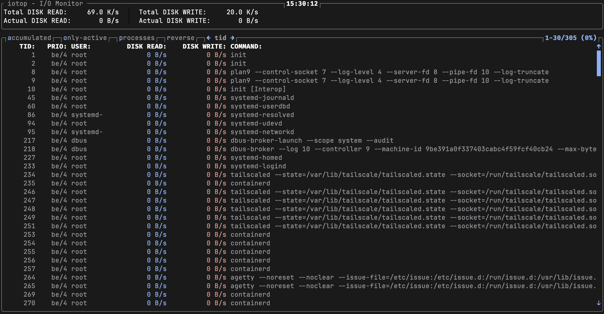

# iotop - Rust Implementation

A Rust implementation of iotop, a tool to monitor I/O usage of processes on Linux.


 

## Snapshot



## Installation

### From Cargo (Recommended)

Install directly from crates.io:
```bash
cargo install iotop
```

### From Source

Clone and build from source:
```bash
git clone https://github.com/AndPuQing/iotop.git
cd iotop
cargo build --release
```

The binary will be available at `./target/release/iotop`.

### System-wide Installation

#### Option 1: Copy binary to system path
```bash
cargo build --release
sudo cp target/release/iotop /usr/local/bin/
sudo cp doc/iotop.8 /usr/share/man/man8/
sudo mandb  # Update man page database
```

#### Option 2: Using cargo install with prefix
```bash
cargo install --path . --root /usr/local
sudo cp doc/iotop.8 /usr/share/man/man8/
sudo mandb
```

### Permissions Setup

iotop requires root privileges to access the kernel's taskstats interface. You have two options:

#### Option 1: Run with sudo (simplest)
```bash
sudo iotop
```

#### Option 2: Grant CAP_NET_ADMIN capability (no sudo needed)
```bash
# Allow iotop to run without sudo by granting the required capability
sudo setcap cap_net_admin+eip /usr/local/bin/iotop

# Now you can run without sudo
iotop
```

### Enable Kernel Delay Accounting

For full functionality (SWAPIN and IO columns), enable kernel delay accounting:
```bash
# Temporary (until reboot)
sudo sysctl -w kernel.task_delayacct=1

# Permanent (survives reboot)
echo "kernel.task_delayacct = 1" | sudo tee -a /etc/sysctl.conf
sudo sysctl -p
```

## Usage

### Basic Examples

Run interactively:
```bash
sudo iotop
```

Show only processes doing I/O:
```bash
sudo iotop -o
```

Run in batch mode (5 iterations, 2 second delay):
```bash
sudo iotop -b -n 5 -d 2
```

Monitor specific process:
```bash
sudo iotop -p 1234
```

Monitor user's processes:
```bash
sudo iotop -u www-data
```

Batch mode with timestamps:
```bash
sudo iotop -t -b -n 10 > iotop.log
```

### Options

```
-o, --only               Only show processes or threads actually doing I/O
-P, --processes          Show processes, not all threads
-a, --accumulated        Show accumulated I/O instead of bandwidth
-d, --delay <DELAY>      Delay between iterations in seconds [default: 1.0]
-n, --iter <ITERATIONS>  Number of iterations before ending (infinite if not specified)
-b, --batch              Batch mode (non-interactive)
```


### Development

The project uses standard Rust tooling:

```bash
# Build
cargo build

# Run tests (when added)
cargo test

# Check for issues
cargo clippy

# Format code
cargo fmt
```

### License

MIT License

### Original Python Version

The original Python implementation can be found at:
- Upstream: https://github.com/Tomas-M/iotop (C version)
- Original Python: http://guichaz.free.fr/iotop/

### Contributing

This is a migration project. Contributions to missing features are welcome.
